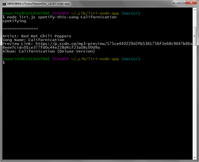

# liri-node-app
 A command line node app that takes in parameters and gives you back data using Twitter, Spotify, and Request, for OMDB, node packages.

### How can I view the app?

1. Install node if it's not already.
2. Open the folder directory in your terminal.
3. Run `npm install` to download all the dependencies required for this app.
4. Create `.env` file - See below
5. Type `node liri.js 'command' 'argument(s)'`

> Env File 
* This file will be used by the `dotenv` package to set what are known as environment variables to the global `process.env` object in node. These are values that are meant to be specific to the computer that node is running on, and since I am gitignoring this file, it won't be pushed to github &mdash; keeping my API key information private.  
* If you wanted to download or clone and run the app, you would need to supply your own `.env` file for it to work and add your API tokens

### Commands and Arguments

* The application takes 4 different commands

  * `my-tweets`
  * `spotify-this-song`
  * `movie-this`
  * `do-what-it-says`

* `spotify-this-song` and `movie-this` take arguments that can be typed after their appropriate command.

For example: 
* `node liri.js spotify-this-song Californication` 

* `node liri.js movie-this Jurassic Park` 

